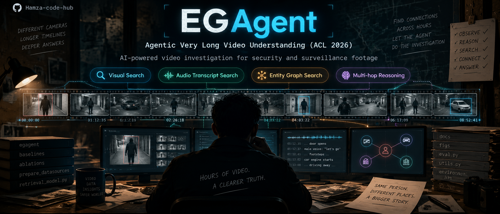
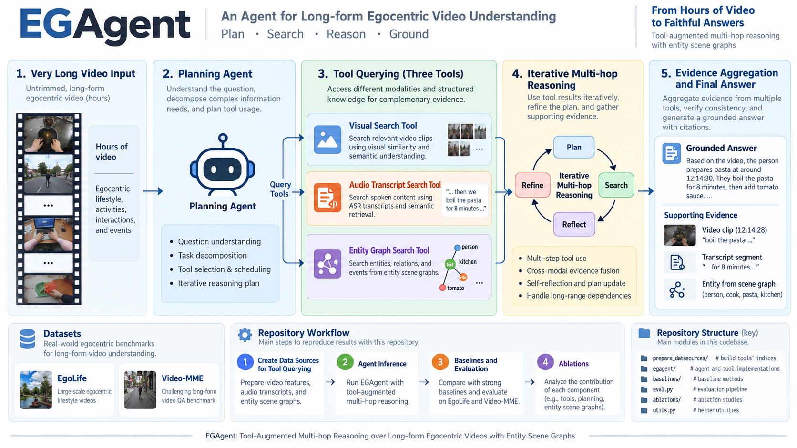
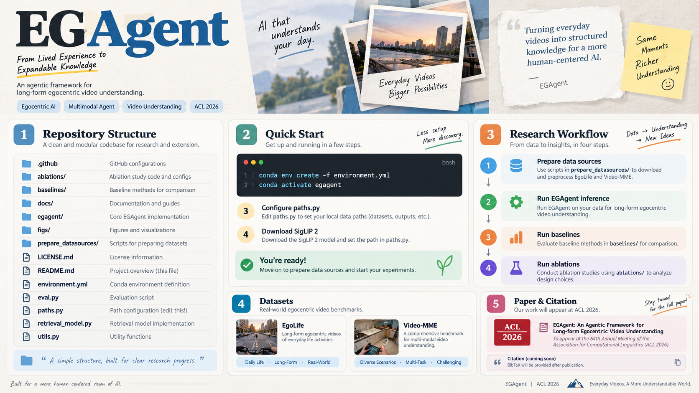

# EGAgent — Agentic Very Long Video Understanding

<p align="center">
  
</p>

<p align="center">
  <strong>Agentic reasoning for very long video understanding with visual search, audio transcript search, and entity graph search.</strong><br/>
  A research framework for turning hours of video into grounded, evidence-backed answers.
</p>

<p align="center">
  <a href="#overview">Overview</a> •
  <a href="#system-architecture">Architecture</a> •
  <a href="#repository-workflow">Workflow</a> •
  <a href="#installation">Installation</a> •
  <a href="#project-structure">Structure</a> •
  <a href="#datasets">Datasets</a> •
  <a href="#citation">Citation</a> •
  <a href="#license">License</a>
</p>

<p align="center">
  
  
  
  
  
</p>

---

## Overview

**EGAgent** is an agentic framework for **very long video understanding**. It is designed for settings where a model must reason over extended videos rather than a short clip, and where a single modality is not sufficient for accurate answering.

The framework uses a **planning agent** that performs **multi-hop cross-modal reasoning** by interacting with three specialized tools:

- **Visual Search Tool** — finds relevant visual segments in long videos
- **Audio Transcript Search Tool** — retrieves relevant spoken content
- **Entity Graph Search Tool** — queries entities, relationships, and scene-level structure

This design helps the system move from raw long-form footage to **grounded answers supported by evidence**.

### Links

- **Project Page:** https://facebookresearch.github.io/egagent/
- **Paper:** https://arxiv.org/abs/2601.18157

---

## What the Project Covers

EGAgent is organized around three major workstreams:

1. **Create data sources for tool querying**
2. **Run agent inference**
3. **Benchmark against baselines and analyze ablations**

In practice, that means the repository includes:

- tooling to prepare data sources used by the tools
- inference code for EGAgent
- baseline evaluation code
- ablation code for retrieval recall and paper figures
- utilities for evaluation and path configuration

---

## System Architecture

<p align="center">
  
</p>

The core reasoning loop can be summarized as:

```text
Very Long Video
      ↓
Planning Agent
      ↓
Tool Querying
 ├─ Visual Search
 ├─ Audio Transcript Search
 └─ Entity Graph Search
      ↓
Iterative Multi-hop Reasoning
      ↓
Evidence Aggregation
      ↓
Grounded Answer
```

### Core Design Principles

| Component | Role |
|---|---|
| **Planning Agent** | Understands the question, decomposes the problem, and decides which tools to use. |
| **Visual Search Tool** | Retrieves visually relevant clips or frames from long videos. |
| **Audio Transcript Search Tool** | Searches speech transcripts for spoken evidence. |
| **Entity Graph Search Tool** | Uses structured entity-scene knowledge to support reasoning. |
| **Multi-hop Reasoning Loop** | Iteratively refines search, cross-checks evidence, and improves the answer. |
| **Evidence Aggregation** | Combines multimodal signals into a grounded response. |

---

## Repository Workflow

<p align="center">
  
</p>

The main end-to-end research workflow is:

```text
Prepare Data Sources
        ↓
Run EGAgent Inference
        ↓
Run Baseline Inference
        ↓
Run Ablations and Analysis
```

### 1) Create Data Sources for Tool Querying

The repository includes code for creating data sources used by the **visual search** and **entity graph** tools.

Location:

```text
prepare_datasources/
```

The audio transcript tool works differently: transcripts are queried **on the fly**, so it does not require an explicit pre-built data source in the same way.

### 2) EGAgent Inference

Inference code for EGAgent on benchmark datasets is provided in:

```text
egagent/
```

### 3) Baseline Inference

Comparison code for alternative baseline methods is provided in:

```text
baselines/
```

These baselines represent approaches that uniformly sample frames and transcripts for long-video understanding.

### 4) Ablations

Ablation code is provided in:

```text
ablations/
```

This includes code to:

- compute retrieval recall of EGAgent tools
- generate plots used in the paper
- analyze the contribution of different components

---

## Installation

Install the conda environment from the provided environment file.

```bash
conda env create -f environment.yml
conda activate egagent
```

---

## Configure Paths

Before running the repository, update dataset paths, model paths, and API key locations in:

```text
paths.py
```

This file should be configured for your local environment before launching scripts.

---

## Set Up the Multimodal Embedding Model

The visual search tool uses a multimodal embedding model. The project uses **SigLIP 2** by default.

Download the model checkpoint:

```bash
git lfs install
git clone https://huggingface.co/google/siglip2-giant-opt-patch16-384
```

If needed, adjust the download or checkpoint location through `paths.py`.

---

## Quick Start

A minimal setup sequence looks like this:

### 1. Create the environment

```bash
conda env create -f environment.yml
conda activate egagent
```

### 2. Configure local paths

Edit:

```text
paths.py
```

### 3. Download the embedding model

```bash
git lfs install
git clone https://huggingface.co/google/siglip2-giant-opt-patch16-384
```

### 4. Prepare tool data sources

Use the scripts under:

```text
prepare_datasources/
```

### 5. Run EGAgent inference

Use the inference code under:

```text
egagent/
```

### 6. Evaluate baselines or ablations

Use:

```text
baselines/
ablations/
```

---

## Project Structure

The repository is compact and research-oriented.

```text
EGAgent/
├── .github/                # GitHub configuration
├── ablations/              # Ablation studies, retrieval recall, plots
├── baselines/              # Baseline inference and comparison methods
├── docs/                   # Documentation
├── egagent/                # Core EGAgent inference code
├── figs/                   # Figures and visual assets
├── prepare_datasources/    # Scripts for creating tool data sources
├── LICENSE.md              # License
├── README.md               # Project overview
├── environment.yml         # Conda environment definition
├── eval.py                 # Evaluation script
├── paths.py                # Dataset / model / API path configuration
├── retrieval_model.py      # Retrieval model code
└── utils.py                # Utility functions
```

### Key Directories

| Path | Purpose |
|---|---|
| `prepare_datasources/` | Build the data sources used by the visual and graph tools |
| `egagent/` | Run the agentic framework on supported datasets |
| `baselines/` | Evaluate alternative methods for comparison |
| `ablations/` | Study retrieval recall and reproduce analysis plots |
| `figs/` | Teaser figures and paper visuals |
| `docs/` | Supporting documentation |

---

## Benchmarks and Datasets

The project mentions two main evaluation benchmarks:

### EgoLife
A benchmark based on long-form egocentric videos of daily-life activities.

### Video-MME
A benchmark for long-form multimodal video understanding.

These datasets are used to test how well EGAgent can search, reason, and answer over extended video content.

---

## Research Positioning

EGAgent is particularly useful for problems where:

- videos are too long for naive end-to-end processing
- useful evidence is distributed across time
- answers require combining visual and spoken information
- entity-level structure improves reasoning
- grounded answers need explicit supporting evidence

Potential application themes include:

- long-form video QA
- video investigation workflows
- activity understanding
- multimodal retrieval and reasoning
- research on long-context multimodal agents

---

## Citation

If you find this project useful in your research, please consider citing:

```bibtex
@inproceedings{rege2026agentic,
  title={Agentic very long video understanding},
  author={Rege, Aniket and Sadhu, Arka and Li, Yuliang and Li, Kejie and Vinayak, Ramya Korlakai and Chai, Yuning and Lee, Yong Jae and Kim, Hyo Jin},
  booktitle={Proceedings of the 64th Annual Meeting of the Association for Computational Linguistics (Volume 1: Long Papers)},
  pages={46575--46602},
  year={2026}
}
```

---

## Contribution

See the repository's `CONTRIBUTING.md` file if you want to help improve the project.

---

## License

This code is licensed under **CC-BY-NC 4.0**.

See `LICENSE.md` for full terms.

---

<p align="center">
  <strong>From hours of video to grounded answers.</strong>
</p>
